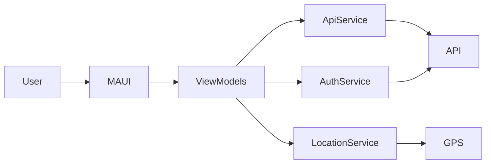
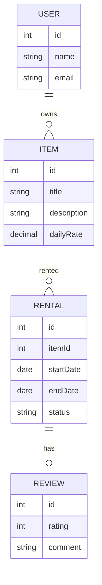
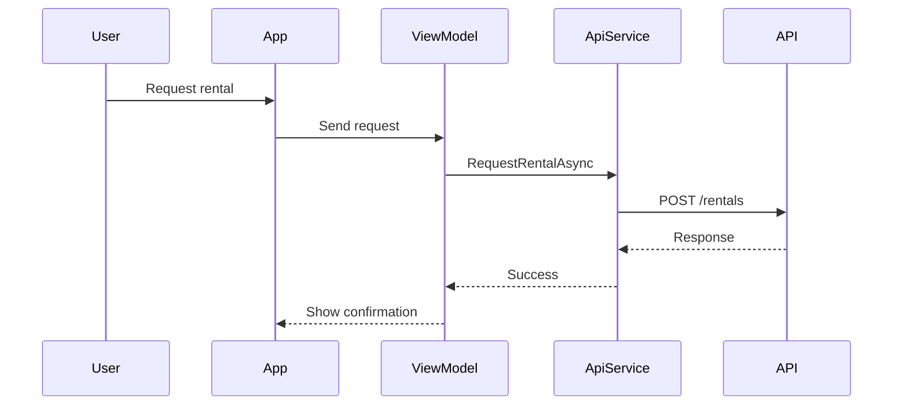

## Component Diagram

```mermaid
flowchart LR
   User --> MAUI
   MAUI --> ViewModels
   ViewModels --> ApiService
   ViewModels --> LocationService
   ViewModels --> AuthService
   ApiService --> API
   AuthService --> API
   LocationService --> GPS
```
---
## Database Schema Diagram

```mermaid
erDiagram
   USER ||--o{ ITEM : owns
   ITEM ||--o{ RENTAL : rented
   RENTAL ||--o| REVIEW : has
   USER {
       int id
       string name
       string email
   }
   ITEM {
       int id
       string title
       string description
       decimal dailyRate
   }
   RENTAL {
       int id
       int itemId
       date startDate
       date endDate
       string status
   }
   REVIEW {
       int id
       int rating
       string comment
   }
```
---
## Rental Workflow Sequence Diagram

```mermaid
sequenceDiagram
   participant User
   participant App
   participant ViewModel
   participant ApiService
   participant API
   User->>App: Request rental
   App->>ViewModel: Send request
   ViewModel->>ApiService: RequestRentalAsync
   ApiService->>API: POST /rentals
   API-->>ApiService: Response
   ApiService-->>ViewModel: Success
   ViewModel-->>App: Show confirmation
```